# 1. Análise de Concorrentes

> Identificação dos principais concorrentes mais utilizados pelo público-alvo, com caracterização de funcionalidades, opiniões de UX, preços/modelo de negócio, padrões de mercado e recomendações.

---

## 1. Petzillas

**Links:**
Android: https://play.google.com/store/apps/details?id=com.petzillas.app&pcampaignid=web_share  
IOS: https://apps.apple.com/br/app/petzillas/id1347981298  
**Plataforma:** Google Play Store e Apple Store  
**Descrição geral:** Aplicativo destinado aos donos de pets que querem fazer um monitoramento completo da rotina do animal, integrando dados veterinários que vão de vacinas e medicamentos até banho, tosa e higiene.

### 1.1 Prints de tela

Prints do Petzillas

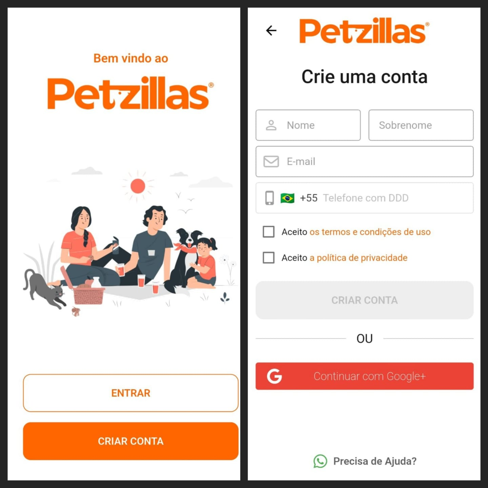
*Cadastro de usuário*

&nbsp;

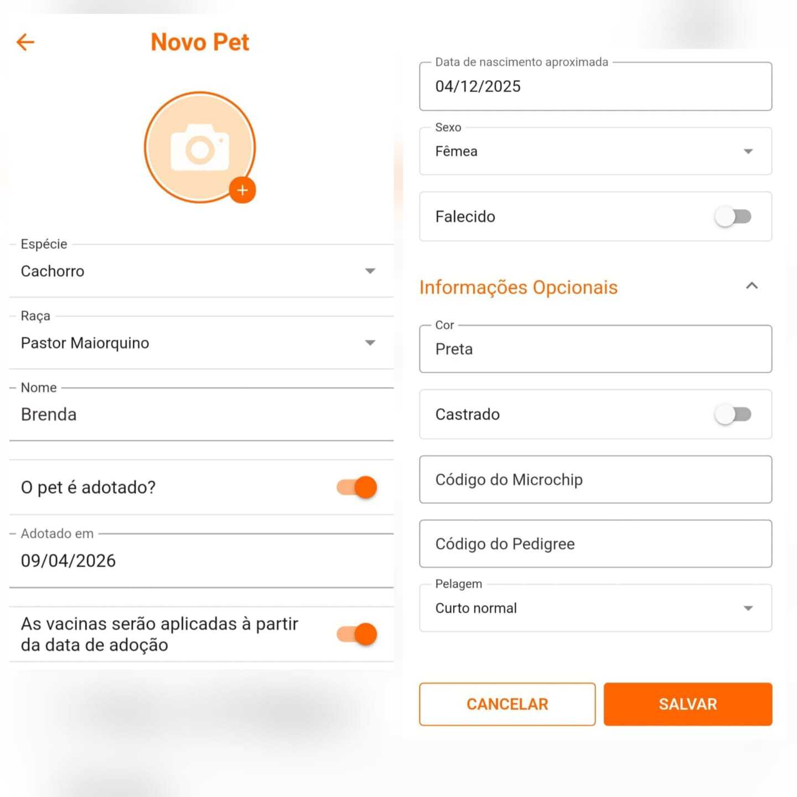
*Cadastro de animal*

&nbsp;

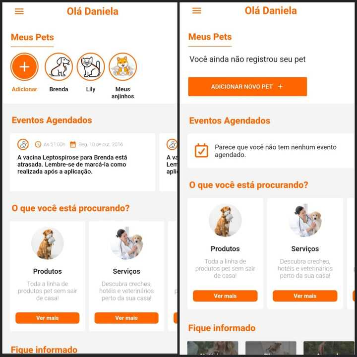
*Menu inicial. Tela esquerda: antes de adicionar um pet. Tela direita: após adicionar*

&nbsp;

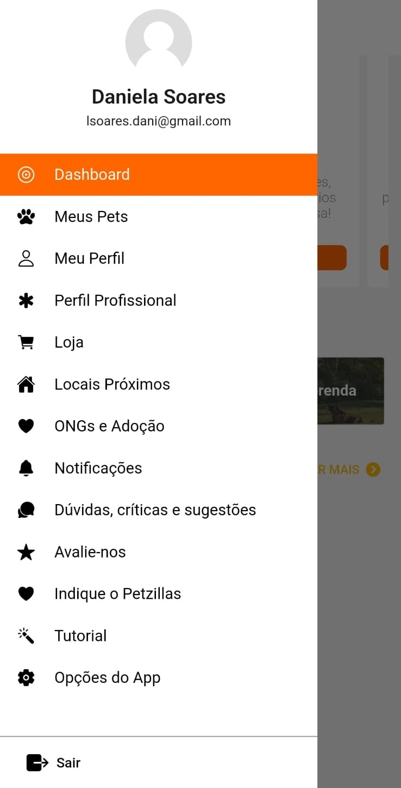
*Menu lateral*

&nbsp;

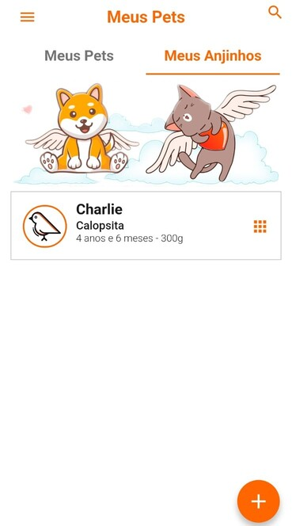
*Menu que mostra pets já falecidos com título "Meus anjinhos".*

&nbsp;

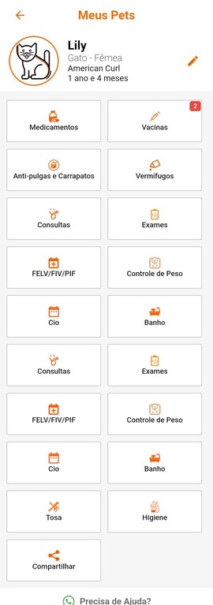
*Menu de exemplo de pet cadastrado*

&nbsp;

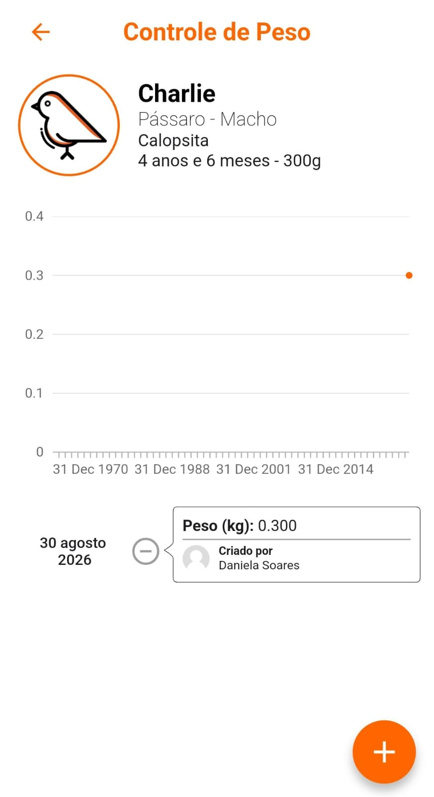
*Exemplo de funcionalidade: peso de animal*

&nbsp;

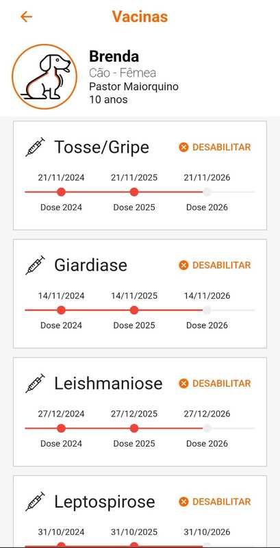
*Acompanhamento de vacinas.*

&nbsp;

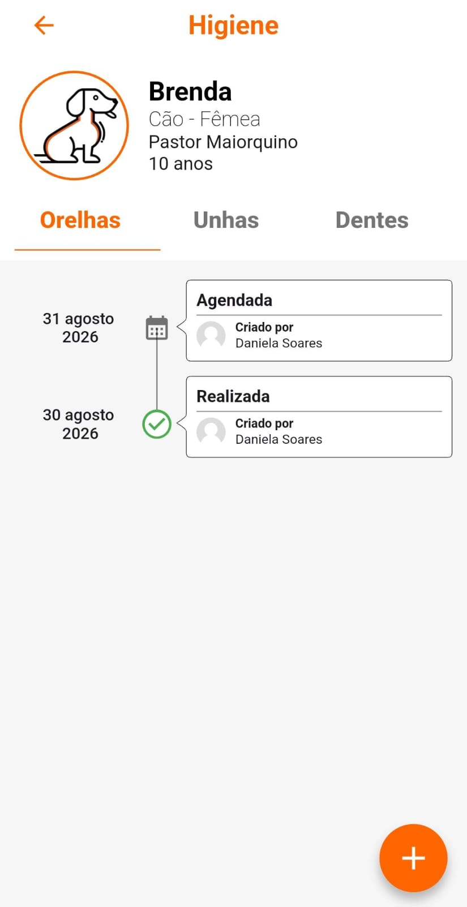
*Exemplo genérico de agendamento de higiene*

&nbsp;

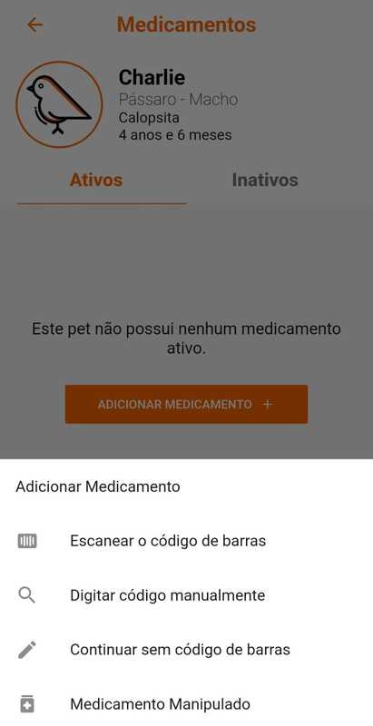
*Exemplo de medicamentos adicionados]*

&nbsp;

### 1.2 Características e funcionalidades
- **Adicionar e remover pets:** informar espécie, subespécie, raça, nome, se foi adotado, nascimento, sexo, se é falecido, cor, número de microchip.
- **Funções específicas por tipo de animal** (ex: gato): medicamentos, vacinas, anti-pulgas e carrapatos, vermífugos, consultas, exames, FELV/FIV/PIF, controle de peso, cio, banho, tosa e higiene.
- **Compartilhamento de dados:** compartilhar informações do pet com outros tutores via link com código de acesso, com opção de permissão somente leitura.
- **Lembretes de eventos agendados:** notificações sobre vacinas atrasadas/a realizar, consultas veterinárias e outras atividades cadastradas.
- **Locais credenciados:** busca de produtos (catálogo próprio e exclusivo) e locais próximos no mapa que oferecem creche, banho e tosa, hotéis e ONGs de doação.

### 1.3 Opiniões sobre a experiência do usuário

| Fonte | Resumo da opinião | Sentimento |
|---|---|---|
| Apple Store | Usuários relatam eficiência no controle de vacinas, peso, consultas e dados gerais do pet; o compartilhamento entre tutores é visto como útil | Positivo |
| Google Play Store | Destaque para o suporte emocional a tutores enlutados, com seção "Meus anjinhos" e e-mail de condolências | Positivo |
| Google Play Store | Reclamações de que o aplicativo só funciona online | Negativo |

### 1.4 Preços e modelo de negócio
- **Modelo:** Free - Totalmente gratuito, sem versão paga.

### 1.5 Pontos fortes e fracos

| Pontos fortes | Pontos fracos |
|---|---|
| Interface amigável | Usuário pode se sentir sobrecarregado com a quantidade de detalhes de agendamento |
| Variedade de funcionalidades (agendamento, vacinas, saúde geral) | Não funciona offline |
| Diversidade de campos e funções por tipo de pet | |

---

## 2. 11Pets

**Links:**  
Android: https://play.google.com/store/apps/details?id=com.m11pets.elevenpets&pcampaignid=web_share  
IOS: https://apps.apple.com/us/app/11pets-pet-care/id1232470530  
**Plataforma:** Google Play Store e Apple Store  
**Descrição geral:** Destinado aos donos de animais de estimação que querem controlar e realizar agendamentos de serviços de forma online e controlar aspectos da saúde do pet, além da gestão de tarefas.  

### 2.1 Prints de tela

📱 Ver prints do 11Pets

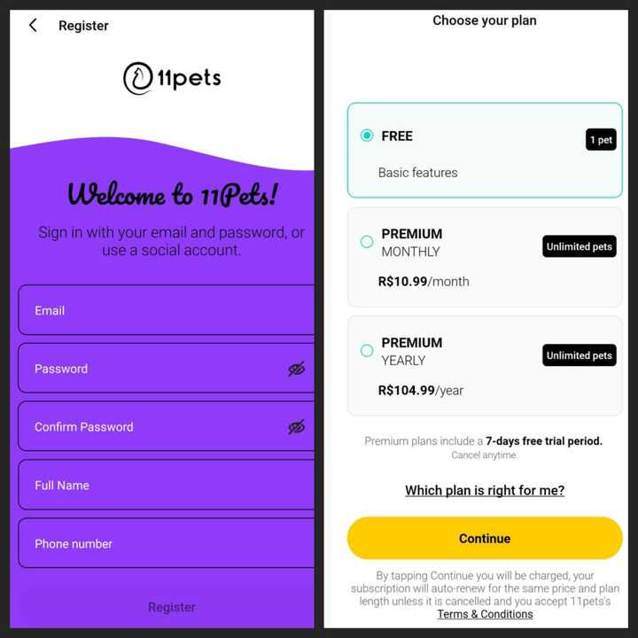
*Tela inicial de cadastro de usuário seguida de anúncio de plano pago*

&nbsp;

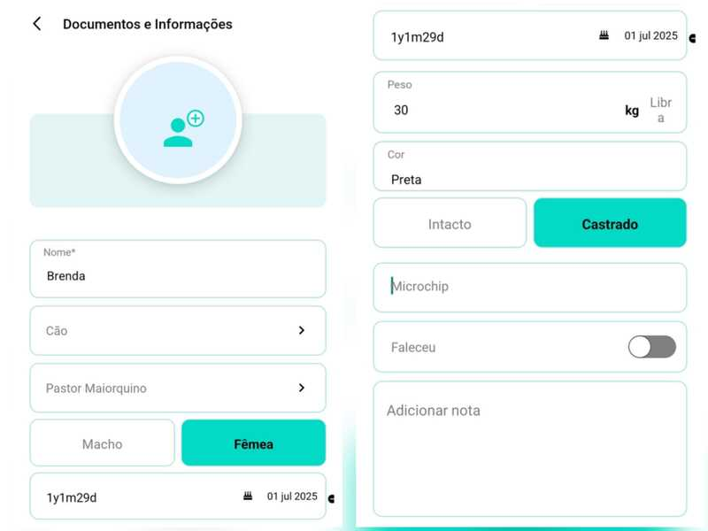
*Cadastro de pet. A tela direita é continuação do scroll da esquerda.*

&nbsp;

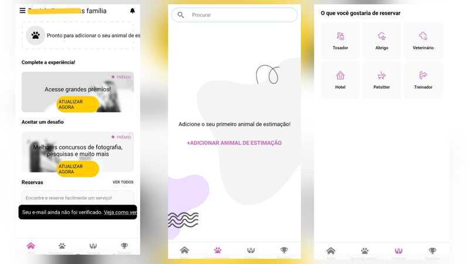
*Tela 1: resumo inicial; Tela 2: painel de animais de estimação; Tela 3: reservas de serviços.*

&nbsp;

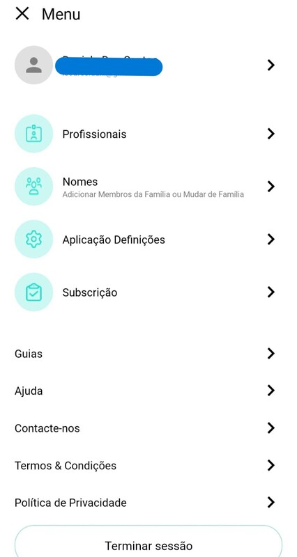
*Menu lateral e detalhes.*

&nbsp;

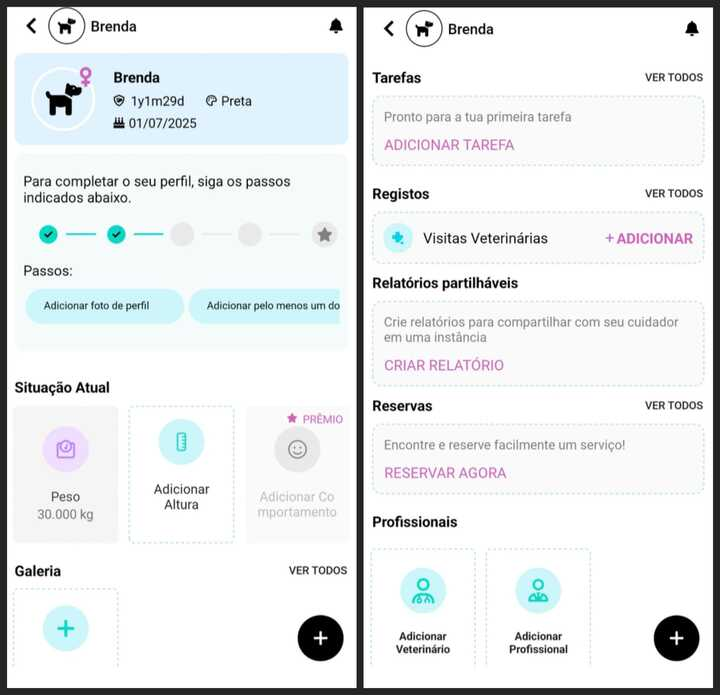
*Menu de resumo de um pet.*

&nbsp;

### 2.2 Características e funcionalidades
- **Cadastro de pets:** registro de pets com características variadas.
- **Agendamentos:** possibilidade de agendar em redes da região *(obs: app apresenta travamentos ao realizar essa função)*.
- **Monitoramento do pet:** visitas veterinárias, reservas de serviços, tarefas a fazer (ex: limpeza de recipientes), galeria de fotos, peso/altura.
- **Perfil de profissionais:** possibilidade de adicionar veterinários responsáveis pelo acompanhamento do pet.

### 2.3 Opiniões sobre a experiência do usuário

| Fonte | Resumo da opinião | Sentimento |
|---|---|---|
| Google Play Store | Usuários relatam perda de usabilidade após atualizações, sem manter painel de lembretes nem visualização organizada dos agendamentos | Negativo |
| Google Play Store | Funções gratuitas consideradas muito limitadas, com baixa usabilidade | Negativo |
| Apple Store | Dificuldade relatada ao realizar o cadastro no aplicativo | Negativo |

### 2.4 Preços e modelo de negócio
- **Modelo:** Freemium
- **Planos e valores:** R$10,99 mensal ou R$104,99 anual

### 2.5 Pontos fortes e fracos

| Pontos fortes | Pontos fracos |
|---|---|
| Variedade na proposta de agendamentos e pendências do pet | Lentidão constante |
| | Pop-ups frequentes para assinatura de planos pagos |
| | UI pouco amigável, sobrecarregada de detalhes |

---

## 3. Petlove

**Links:** 
Android: https://play.google.com/store/apps/details?id=br.com.petlove.petlove&hl=en  
IOS: https://apps.apple.com/br/app/petlove-petshop-e-sa%C3%BAde-pet/id828960201  
Web: https://www.petlove.com.br/  
**Plataforma:** Navegadores desktop e mobile, Android e IOS  
**Descrição geral:** Ecossistema pago que vai além de petshop, pois integra e-commerce, plano de saúde pet, agendamento de serviços e monitoramento de rotina do pet em um só app.

### 3.1 Prints de tela

📱 Ver prints do Petlove

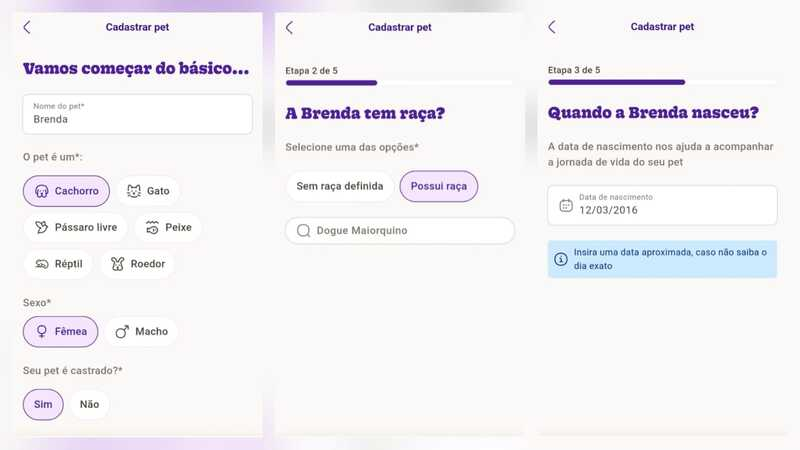  
*Cadastro guiado ao inicializar o app pela primeira vez - cadastrar um animal*

&nbsp;

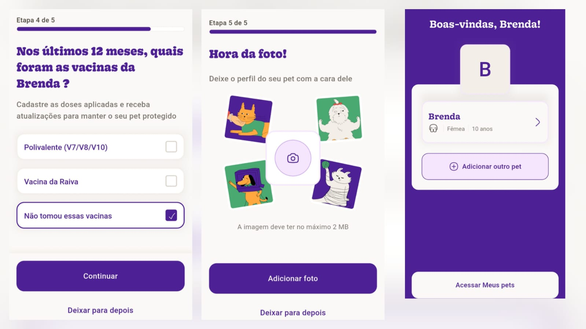  
*Continuação do cadastro de animal*

&nbsp;

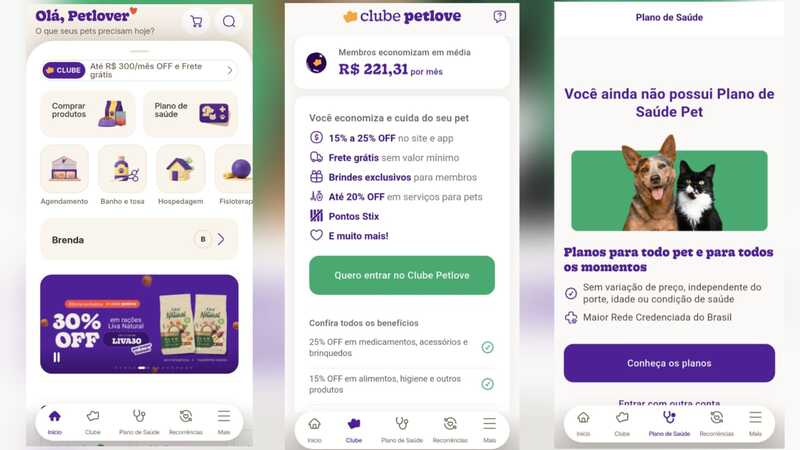  
*Menu inicial: Tela 1 inclui o dashboard inicial, tela 2 a assinatura paga (club petlove), tela 3 os planos de saúde*  

&nbsp;

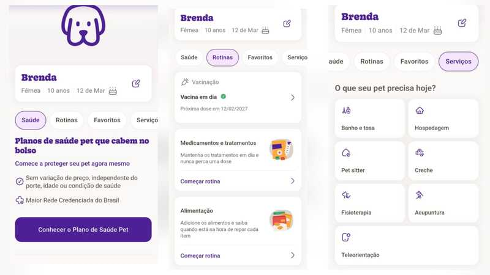  
*Menu de pets*  

&nbsp;

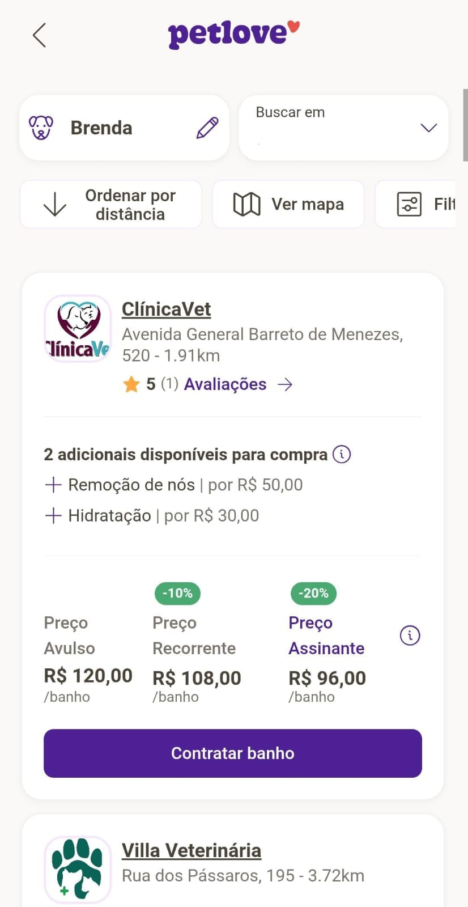  
*Exemplo de funcionalidade: agendamento de banho*  

&nbsp;

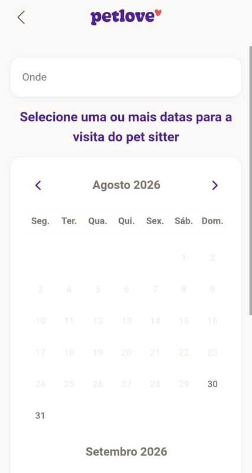
*Exemplo de funcionalidade: agendamento de pet sitter*  

&nbsp;

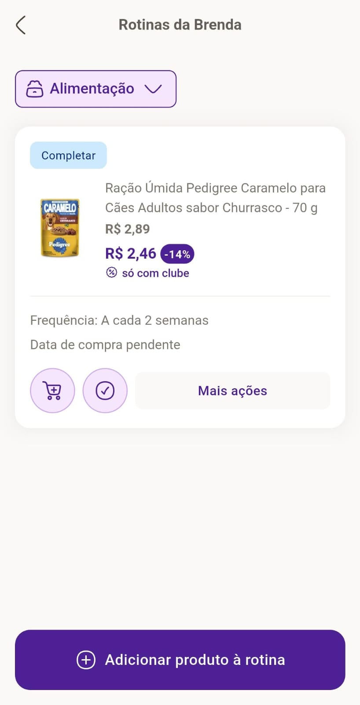
*Exemplo de funcionalidade: rotina de alimentação com produtos adicionados da loja*  

&nbsp;

### 3.2 Características e funcionalidades
- **Agendamento de serviços:** banho e tosa, hospedagem, fisioterapia, creche, pet sitter, teleorientação e acupuntura, com prestadores identificados pela aplicação.
- **Loja de produtos:** loja própria com variedade de produtos e promoções, adicionáveis ao carrinho com entrega em casa.
- **Planos de saúde:** contratação de planos variados para os pets.
- **Entrega programada (recompra automática):** pedidos realizados automaticamente, com lembrete prévio de que o valor será debitado na forma de pagamento escolhida.
- **Menu do pet:** acompanhamento de rotinas de alimentação, vacinação e tratamentos, além de área de favoritos e de serviços disponíveis.

### 3.3 Opiniões sobre a experiência do usuário

| Fonte | Resumo da opinião | Sentimento |
|---|---|---|
| Reddit | Usuários satisfeitos com os planos de saúde oferecidos e com a usabilidade para administrá-los | Positivo |
| Google Play Store | UI amigável e de fácil uso, boas promoções regionais e informações detalhadas, apesar de bugs ao iniciar o app | Misto |
| Apple Store | Dificuldades relatadas ao cadastrar cartão de crédito para pagamento de pedidos | Negativo |

### 3.4 Preços e modelo de negócio
- **Modelo:** Híbrido - possui serviços e produtos pagos, mas o uso é gratuito dentro do app.  
- **Planos e valores:**  
  Clube petlove: 12x de 9,99 reais por ano.
  Clube petlove plus: 12x de 14,99 reais por ano. Diferencial: possui 2% de cashback sobre as compras e 15-20% off em todos os serviços de agendamento

### 3.5 Pontos fortes e fracos

| Pontos fortes | Pontos fracos |
|---|---|
| Integração entre compra de produtos, serviços, planos de saúde e monitoramento de rotinas | Aplicação pode travar na tela inicial |
| Variedade de funcionalidades | |

---

## 4. Tabela comparativa consolidada

| Critério | Petzillas | 11Pets | Petlove |
|---|---|---|---|
| Público-alvo | Donos de pets que buscam apenas monitoramento | Donos de pets que buscam agendamentos e monitoramento | Donos de pets que buscam agendamentos de serviços, compra online, planos de saúde e atendimento |
| Principais funcionalidades | Monitoramento de saúde/rotina, compartilhamento entre tutores, mapa de locais credenciados | Cadastro e monitoramento de pet, agendamentos, perfil de profissionais | E-commerce, planos de saúde, agendamento de serviços, recompra automática |
| Modelo de negócio | Gratuito | Freemium | Híbrido |
| Faixa de preço | Gratuito | R$10,99 mensal ou R$104,99 anual | De R$9,99 a R$14,99 no clube e R$14,99 a R$199,90 em planos de saúde |
| Ponto forte de UX | Interface amigável, suporte emocional | Variedade de agendamentos | Integração entre áreas de negócio |
| Ponto fraco de UX | Não funciona offline | Lentidão, pop-ups de venda, UI pouco amigável | Trava na tela inicial |

---

## 4. Padrões e tendências identificados no mercado
- Cadastro guiado observado em todas as aplicações
- Variedades de preenchimento no cadastro dos pets para cada tipo de pet. Reptéis possuem subespécies, por exemplo, enquanto gatos possuem vacinas diferentes.
- A maioria das aplicações possuem um modelo que integra loja com variedades de produtos, agendamentos de serviços + o monitoramento de pets.

---

## 5. Síntese e recomendações

**Resumo geral:** Todos os concorrentes possuem funcionalidades de monitoramento de tarefas relacionadas aos pets, mas existem propostas diferentes no mercado para diferentes públicos. No projeto que faremos, talvez não seja ideal integrar serviços de compra de produtos e agendamentos diretos pelo app, visto que o propósito é auxiliar o usuário a monitorar por completo os agendamentos já realizados, as tarefas a fazer, pendências médicas e de higiene.

**Recomendações de uso no nosso produto:**
1. UI amigável e de fácil uso, ícones arredondados
2. Não implementar versão paga, visto que concorrentes fortes possuem todas as funcionalidades de monitoramento dos pets gratuita, menos funções como plano de saúde e produtos digitais.

**O que evitar de acordo com avaliações de concorrentes:**
1. Excesso de pop-ups na tela
2. Interface sobrecarregada e design pouco responsivo
