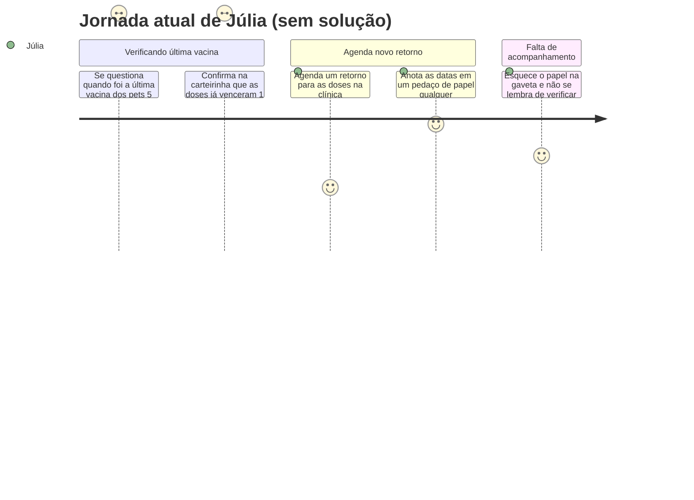

# Cenário de Análise/Problema

### 1) Cenário de Análise/Problema

Júlia é estudante e trabalha em período integral enquanto tem dois animais de estimação, um gato e um cachorro. Ela também divide as tarefas dos animais com a sua mãe. Às vezes, Júlia acaba se esquecendo de renovar as vacinas dos seus animais e de fazer coisas básicas relacionadas a eles no dia a dia, como lavar as vasilhas e repor água e comida. Além disso, são animais diferentes e os cuidados são diferentes, o que torna mais difícil saber quais são as necessidades de cada um. No final das contas, ela se sente um pouco atrapalhada e irresponsável por não se organizar do jeito que queria. 

### 2) Questões de Refinamento

- Por que Júlia se esquece das vacinas e medicamentos?
- O quão frequentes são esses esquecimentos?
- A divisão de tarefas entre Júlia e sua mãe pode não ser o suficiente?
- O que ela faz para tentar resolver essa desorganização?

### 3) Refinamento do Cenário de Análise/Problema

Júlia tem muita correria no seu dia a dia de estudante e trabalhadora, o que sempre a deixa muito cansada para cuidar de todos os aspectos de sua vida pessoal. Isso faz com que, em tempos de renovações de vacinas, animal doente ou agitação nos estudos, ela não dê conta de administrar todos os cuidados que os seus pets precisa. Sua mãe se esforça para ajudar a filha, mas também possui suas pendências e às vezes se estressa com tanta coisa. Por mais que Júlia sofra com a falta de tempo, ela não se esforça tanto para organizar sua rotina; não tem o costume de anotar ou usar ferramentas de lembretes e confia muito na sua memória, que muitas vezes pode ser falha.

### 4) Contexto de Uso

- Júlia mantém seus pets em casa com sua mãe, e ambas utilizam muito o celular no dia a dia, seja em casa ou não. 
- Contexto social: Júlia não está em casa na maior parte do tempo da semana e não consegue estar sempre visualizando as necessidades dos pets.
- A situação piora quando Júlia entra em época de provas ou tem uma alta demanda do trabalho, além de não ter recursos financeiros suficientes para cuidado extra.
- Normalmente Júlia está com a mente agitada e precisa se concentrar em várias coisas ao mesmo tempo.

### 5) Jornada do Usuário (atual, sem solução) — Marina

| Etapa | O que acontece | Estado emocional |
| :---- | :---- | :---- |
| 1. Percebe a necessidade | Júlia se questiona se precisava ter vacinado os seus pets nos últimos tempos | Dúvida |
| 2. Procurando documentos | Procura a carteirinha de vacinação e percebe que tem vacinas vencidas | Frustração |
| 3. Tenta reverter | Agenda um retorno na clínica veterinária para as novas doses que precisavam ser feitas | Alívio |
| 4. Registro | Anota em um pedaço de papel as novas datas e joga em uma gaveta | Confiança |
| 5. Na rotina | Júlia esquece do papel por ter que se preocupar com outras coisas da rotina | Baixa confiança |

