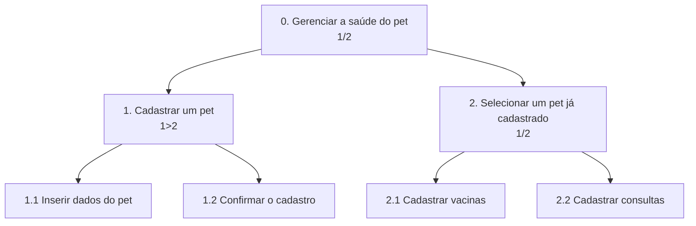

### HTA - Gerenciar os cuidados de saúde do pet

**Funcionalidade**: permitir que o usuário cadastre um pet e registrar vacinas e consultas.

> O plano fica escrito dentro da própria caixa do nó pai, logo abaixo da descrição da tarefa.



- **Plano 0 (`1/2`)**: Cadastrar um pet ou Selecionar um pet já cadastrado no sistema 
- **Plano 1 (`1>2`)**: Inserir dados do pet e confirmar o cadastro
- **Plano 2 (`1/2`)**: Com o pet selecionado pode-se Cadastrar vacinas ou Cadastrar consultas.

### GOMS - Verificar cuidados pendentes e realizar uma ação

**Funcionalidades**: Visualizar lembretes no dashboard e configurar alertas

```
GOAL 0 : acompanhar cuidados pendentes do pet e configurar um alerta

  GOAL 1 : visualizar os cuidados pendentes no dashboard

    METHOD 1.A: acessar os lembretes pelo dashboards
      OP. 1.A.1: acessar o dashboard
      OP. 1.A.2: localizar a sessão de cuidados pendentes
      OP. 1.A.3: verificar lembretes

  GOAL 2: configurar um alerta para um cuidado

    METHOD 2.A: configurar um alerta para o cuidado selecionado
      OP. 2.A.1: selecionar o cuidado desejado
      OP. 2.A.2: acessar a opção de configuração de alerta
      OP. 2.A.3: definir quando o alerta deve ser enviado
      OP. 2.A.4: confirmar a configuração do alerta
```
