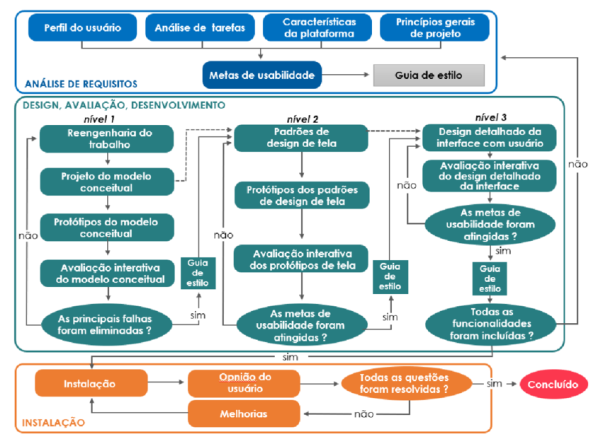

# Requisitos de UX e Metas de Usabilidade

1. **Características da Plataforma**  
   

| Característica | Descrição |
| :---- | :---- |
| Descrição do Software | Aplicação web voltada para o monitoramento de animais de estimação, permitindo cadastrar pets e organizar seus cuidados de saúde, como vacinas e consultas. Além disso, a plataforma também disponibiliza um dashboard com lembretes e configuração de alertas. |
| Descrição do Hardware | A aplicação web poderá ser acessada por computadores, notebooks, tablets e smartphones dês de que tenham conexão com internet. |
| LISTA DE Capacidades da Plataforma (com explicação) | - acesso pelo navegador; - possibilidade de acesso sem a necessidade de aplicativos; - acesso de qualquer dispositivo apenas com o login; - adaptação da interface em vários formatos de tela; - uso em computador, notebook, tablet e celular; - armazenamento de informações dos pets; - cadastramento e alteração de informações; - consulta de dados cadastrados; - visualização do painel com dashboard; - aviso ao usuário sobre cuidados próximos ou pendentes. |
| LISTA DE Restrições da Plataforma (com explicação) | - necessidade de internet para o acesso; - variação da experiencia devido a versão do navegador; - notificações web possuem menos recursos em comparação a aplicações mobile; - dependência de permissões do usuário para utilização de certos recursos. |

2. **Princípios Gerais do Projeto (INCREMENTAR TABELA)**     

| Nome | Descrição | Link |
| :---- | :---- | :---- |
| Descrição do Contexto | Os usuários são tutores de pets, principalmente jovens adultos que possuem rotina corrida, alguns conciliando trabalho e estudos. A maioria utiliza smartphones no dia a dia e atualmente depende principalmente da memória ou de métodos informais para organizar os cuidados dos animais. A plataforma deve facilitar o acompanhamento de vacinas, consultas e outras tarefas, reduzindo esquecimentos e permitindo acesso rápido às informações. |  |
| Lei Geral de Proteção de Dados (LGPD) \- Lei n.º 13.709/2018 | A LGPD é a legislação brasileira que regulamenta o tratamento de dados pessoais no Brasil. É importante para o projeto porque estabelece regras sobre como os dados dos usuários devem ser coletados, armazenados, processados e protegidos, garantindo sua privacidade e segurança. | [https://www.planalto.gov.br/ccivil\_03/\_ato2015-2018/2018/lei/l13709.htm](https://www.planalto.gov.br/ccivil_03/_ato2015-2018/2018/lei/l13709.htm) |
| Lei n.º 10.098/2000 \- Lei da Acessibilidade | Esta lei brasileira estabelece normas gerais e critérios básicos para a promoção da acessibilidade das pessoas com deficiência ou com mobilidade reduzida. É importante para o projeto porque define diretrizes para tornar produtos e serviços, incluindo interfaces de usuário, acessíveis a todos os usuários, independentemente de suas habilidades físicas ou cognitivas. | [https://www.planalto.gov.br/ccivil\_03/leis/l10098.htm](https://www.planalto.gov.br/ccivil_03/leis/l10098.htm) |
| ABNT NBR ISO 9241 Ergonomia da interação humano-sistema | Esta série de normas brasileiras, baseadas nas normas ISO 9241, fornece diretrizes e orientações para o design centrado no usuário de sistemas interativos, incluindo a concepção de interfaces de usuário. A parte 210 aborda o processo de design centrado no humano, enquanto a parte 11 fornece orientações específicas sobre usabilidade. Essas normas são importantes para o projeto porque estabelecem princípios e métodos para garantir que a interface do usuário atenda às necessidades e expectativas dos usuários. | [https://www.inf.ufsc.br/\~edla.ramos/ine5624/\_Walter/Normas/Parte%2011/iso9241-11F2.pdf](https://www.inf.ufsc.br/~edla.ramos/ine5624/_Walter/Normas/Parte%2011/iso9241-11F2.pdf) |
| Facilidade de navegação | As funcionalidades principais devem ser fáceis de localizar e compreender, reduzindo a necessidade de procurar extensivamente por recursos importantes, como lembretes, cadastro de vacinas e consultas. |  |

   

3. **Metas de Usabilidade**

   1. **Qualitativo**

- **Facilidade de aprendizado:** A plataforma deve ser fácil de aprender, permitindo que novos usuários compreendam rapidamente como cadastrar pets, vacinas e consultas.

- **Eficiência:** Os usuários devem conseguir acessar informações importantes sobre seus pets de maneira rápida, especialmente lembretes e cuidados pendentes.

- **Facilidade de navegação:** As funcionalidades devem estar organizadas de maneira clara, permitindo que o usuário encontre facilmente os recursos necessários.

- **Prevenção de esquecimentos:** A plataforma deve auxiliar os usuários a acompanhar cuidados importantes por meio de lembretes e alertas.

   2. **Quantitativo**  
    
| Metas | Porcentagem | Justificativa |
| ----- | :---- | :---- |
| Facilidade de aprendizagem | 25% | Os usuários devem conseguir compreender rapidamente como utilizar as principais funcionalidades, especialmente porque o aplicativo deve facilitar a organização da rotina. |
| Facilidade de navegação | 25% | A pesquisa identificou dificuldades para encontrar funcionalidades em outros aplicativos, tornando a organização clara da interface uma prioridade. |
| Prevenção de esquecimentos | 30% | Os esquecimentos relacionados aos cuidados dos pets foram uma das principais necessidades identificadas na pesquisa com os usuários. |
| Eficiência | 20% | Os usuários possuem rotinas ocupadas e precisam acessar informações e realizar tarefas rapidamente. |
| **Total** | **100%** |  |
