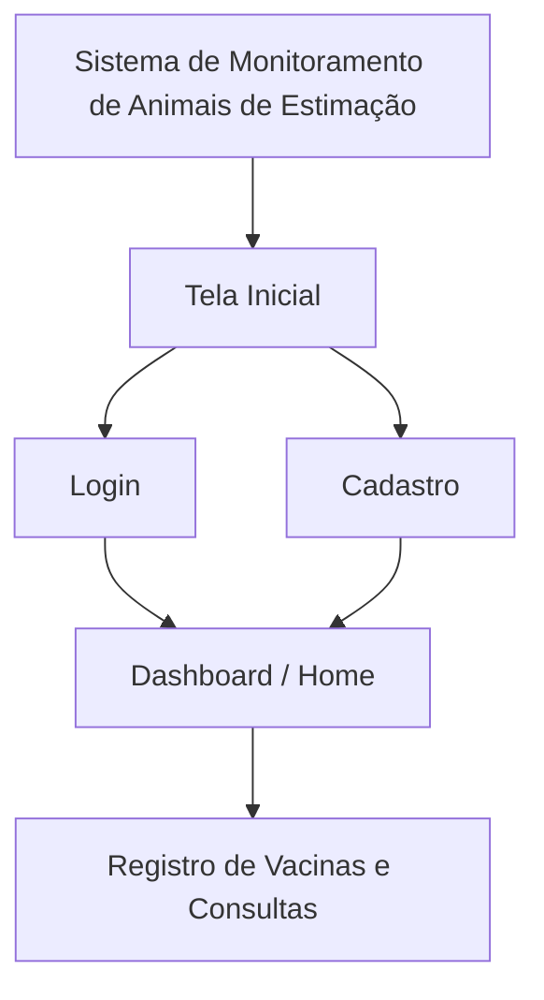
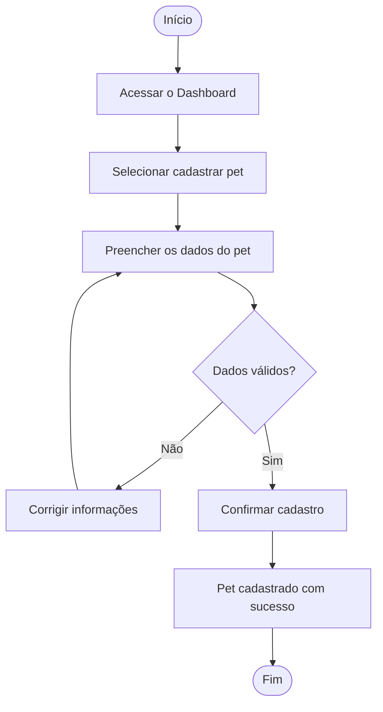
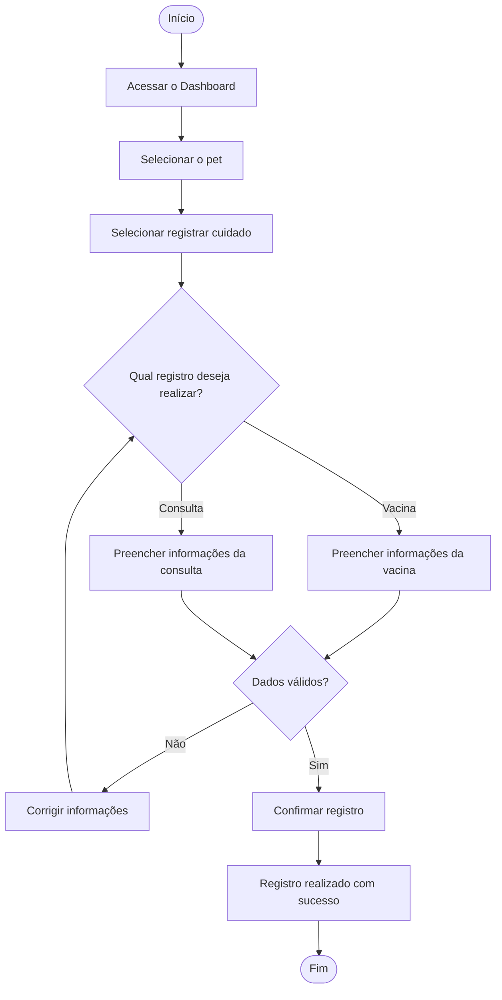
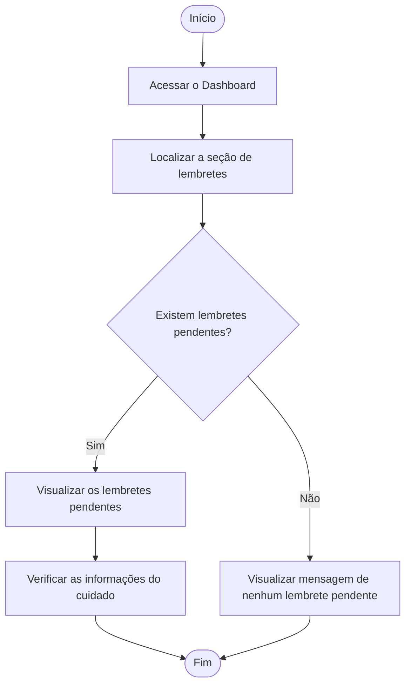
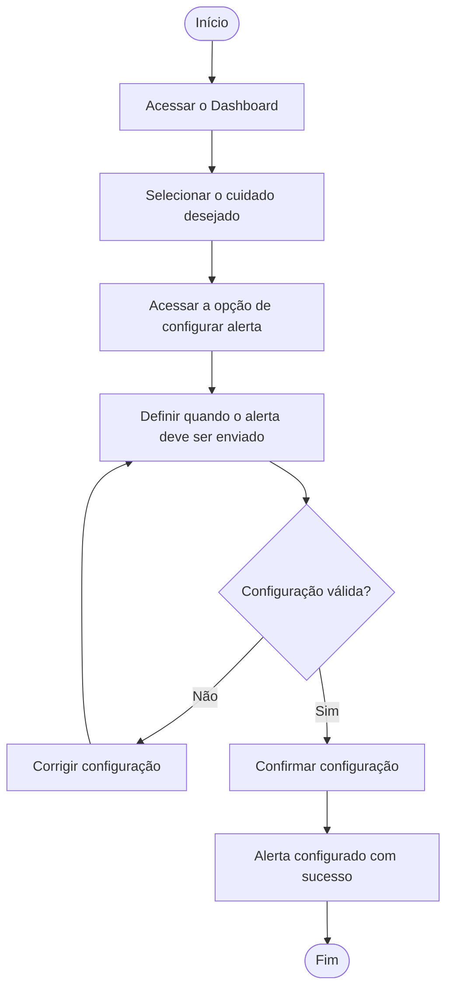

# Arquitetura de Informação e Fluxo do Usuário

## 1) **Arquitetura de Informação (Sitemap)**

### Telas e seções principais

- **Tela Inicial**
  - Login
  - Cadastro

- **Dashboard / Home**

- **Registro de Vacinas e Consultas**

### Sitemap

### Justificativa da organização

A arquitetura de informação foi organizada de forma simples e centralizada, considerando as necessidades identificadas nas personas e na pesquisa realizada com os usuários.

A tela inicial concentra as opções de login e cadastro, permitindo que o usuário acesse a plataforma antes de utilizar suas funcionalidades. Após a autenticação, o usuário é direcionado para o Dashboard, que funciona como a tela principal da aplicação e permite uma visualização central das informações relacionadas aos cuidados dos animais.

A partir do Dashboard, o usuário pode acessar o registro de vacinas e consultas. Essa organização busca facilitar a navegação e reduzir o tempo necessário para encontrar funcionalidades importantes, considerando que as personas possuem rotinas ocupadas e apresentam dificuldades relacionadas à organização e ao esquecimento dos cuidados dos pets.

A estrutura também poderá ser adaptada durante o desenvolvimento da aplicação, principalmente em relação à forma de acesso aos registros, que poderá utilizar componentes da interface web, como páginas ou elementos sobrepostos.

## 2) **Fluxo do Usuário (User Flow)**

### User Flow — Cadastrar um pet

**Funcionalidade:** permitir que o usuário cadastre um animal de estimação na plataforma.

**Objetivo do usuário:** registrar as informações do pet para possibilitar o acompanhamento e a organização de seus cuidados.

### User Flow — Registrar vacinas e consultas

**Funcionalidade:** permitir que o usuário registre informações sobre vacinas e consultas relacionadas ao seu pet.

**Objetivo do usuário:** manter os cuidados de saúde do animal registrados e organizados na plataforma.

### User Flow — Visualizar lembretes no Dashboard

**Funcionalidade:** permitir que o usuário visualize os lembretes relacionados aos cuidados pendentes de seus pets.

**Objetivo do usuário:** acompanhar rapidamente os cuidados que precisam ser realizados para evitar esquecimentos.

### User Flow — Configurar alertas

**Funcionalidade:** permitir que o usuário configure alertas para ser avisado sobre cuidados relacionados aos seus pets.

**Objetivo do usuário:** definir quando deseja receber um alerta para evitar o esquecimento de cuidados importantes.

