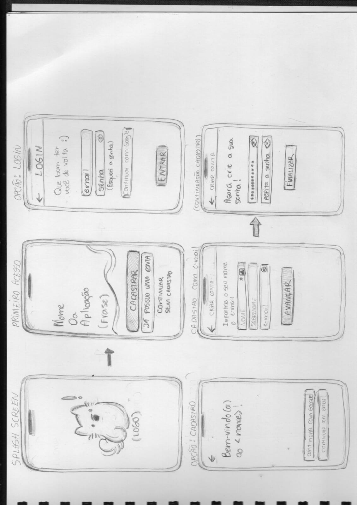
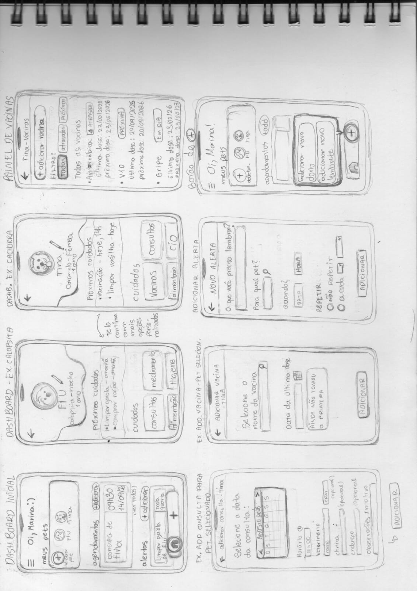
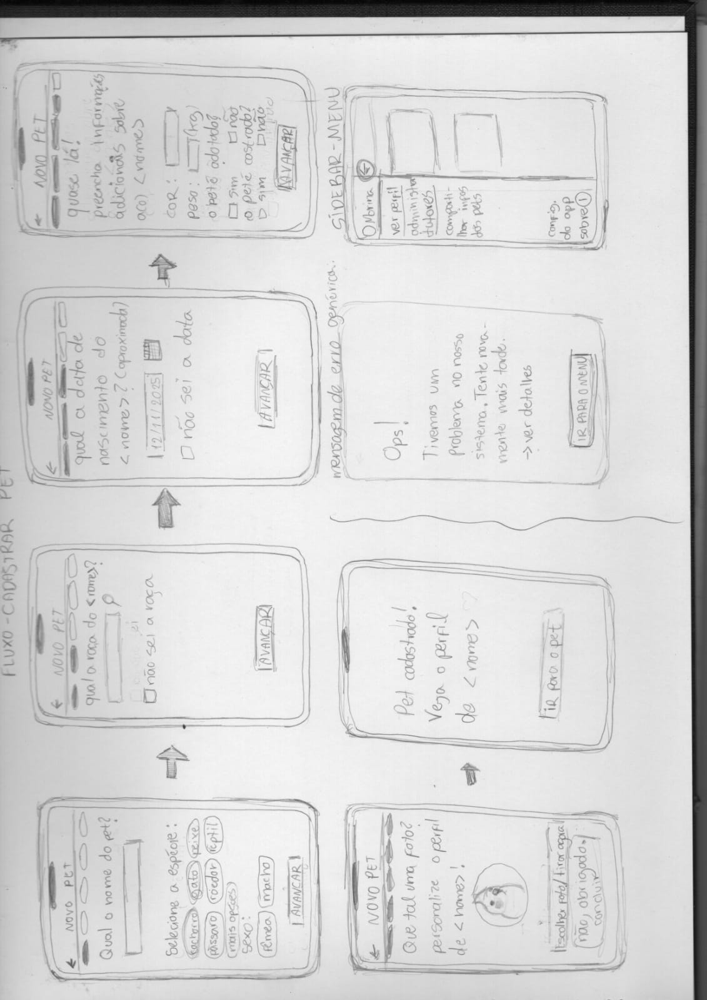

# Prototipação em Papel (Lo-fi)

## Fotos da prototipação inicial

**Página 1 - Elementos:**
- Splash screen
- Cadastro de usuário, login e acesso sem autenticação
  

&nbsp;

**Página 2 - Elementos:**
- Dashboard inicial;
- Dashboard animal 1 e 2;
- Painel de vacinas;
- Adicionar consulta, vacina e alerta.

&nbsp;

**Página 3 - Elementos:**
- Cadastro de novo pet;
- Mensagem de erro genérica;
- Sidebar da home screen;

&nbsp;

## Resumo de feedbacks
De modo geral, os feedbacks dizem que a UI é amigável e atrativa em design. Por outro lado, alguns ícones poderiam estar mais acessíveis e melhor localizados - como os botões de adicionar agendamentos e alertas. 
